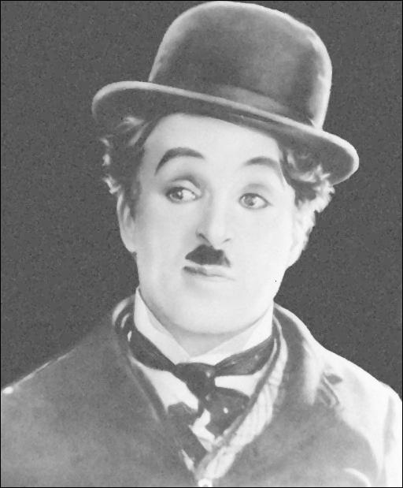
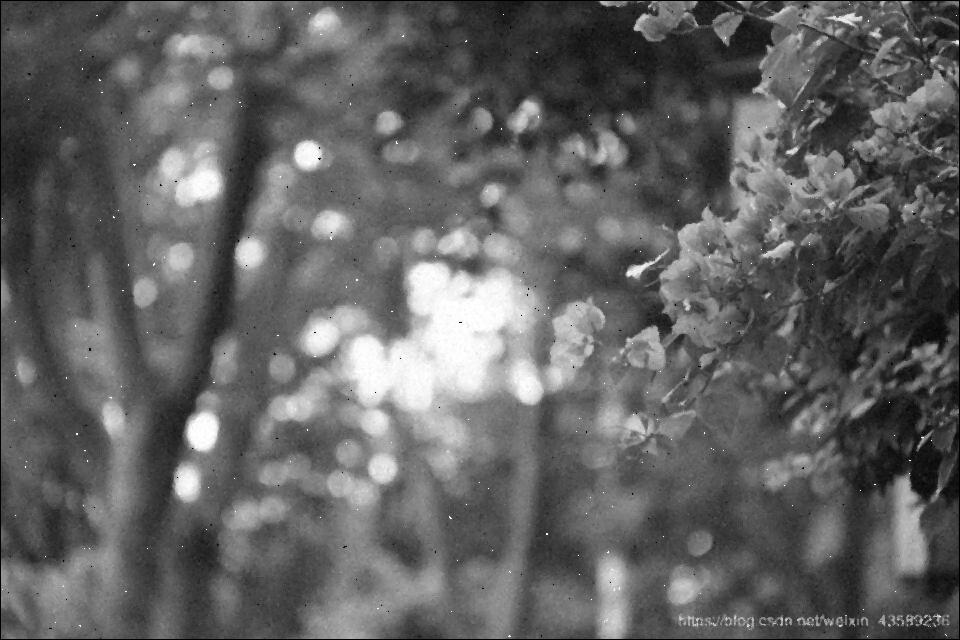

# Scala Median Filter

A [median filter](https://www.cs.auckland.ac.nz/courses/compsci373s1c/PatricesLectures/Image%20Filtering.pdf) implemented in two methods: serial and parallel, simulating an interaction between a user and a server using [Akka Actors.](https://doc.akka.io/docs/akka/current/typed/actors.html)

## Serial Implementation

This was implemented using nested loops in order to go through all the pixels in the image, because of the limits of the implementation the borders of the picture will remain unchanged. A 3x3 square of the pixels of the picture is taken on each iteration, the RGB value is taken from each pixel, then the values are sorted and finally the median is taken. The median of the sorted list is then inserted into the selected pixel.

## Parallel Implementation

The parallel implementation made used of Scala [parallel collections](https://docs.scala-lang.org/overviews/parallel-collections/overview.html), this makes iterations run in parallel. This was the same is the serial implementation, however there are two different aspects. The range is created using **ParRange** by adding **par** at the end of the creation of the range to make it part of a **parallel collection**. 
```Scala
val width = inputImage.getWidth()
val height = inputImage.getHeight() 

val widthRange = 1 to width-2 par
val heightRange = 1 to height-2 par
``` 

The method used for the median filter is the same as the one mentioned before.

# Examples
Two examples are provided of two images with different dimensions. 

## Image 1 (512x619)

### Original Image 


### Processed Image with Serial Filter



### Processed Image with Parallel Filter


Since both processes are done in a similar manner, both give the same output however there is a difference in the time that it takes to complete them.

|    Attempt    | Serial (ms) | Parallel (ms) | Difference |
|:-------------:|:-----------:|:-------------:|:----------:|
|       1       |     234     |      179      |     55     |
|       2       |     236     |      208      |     28     |
|       3       |     236     |      183      |     53     |
|       4       |     210     |      185      |     25     |
|       5       |     224     |      176      |     48     |
| ***Average*** |     228     |     186.2     |    41.8    |

## Image 2 (960x640)

### Original Image


### Processed Image with Serial Filter



### Processed Image with Parallel Filter


|    Attempt    | Serial (ms) | Parallel (ms) | Difference |
|:-------------:|:-----------:|:-------------:|:----------:|
|       1       |     404     |      302      |    102     |
|       2       |     446     |      310      |    136     |
|       3       |     424     |      278      |    146     |
|       4       |     441     |      272      |    169     |
|       5       |     429     |      287      |    142     |
| ***Average*** |    428.8    |     289.8     |    139     |

As seen in this two examples the difference between the serial and parallel process is more significant if the image is bigger.